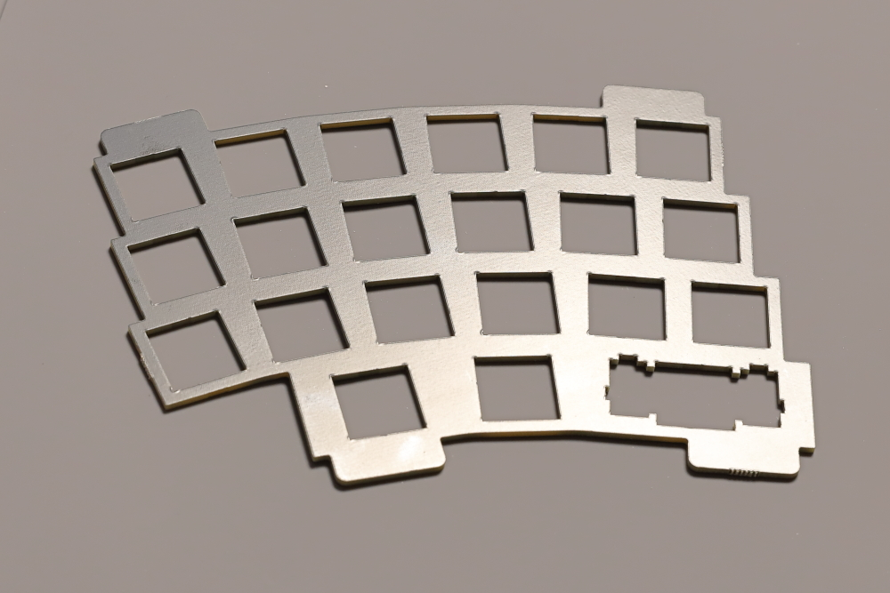
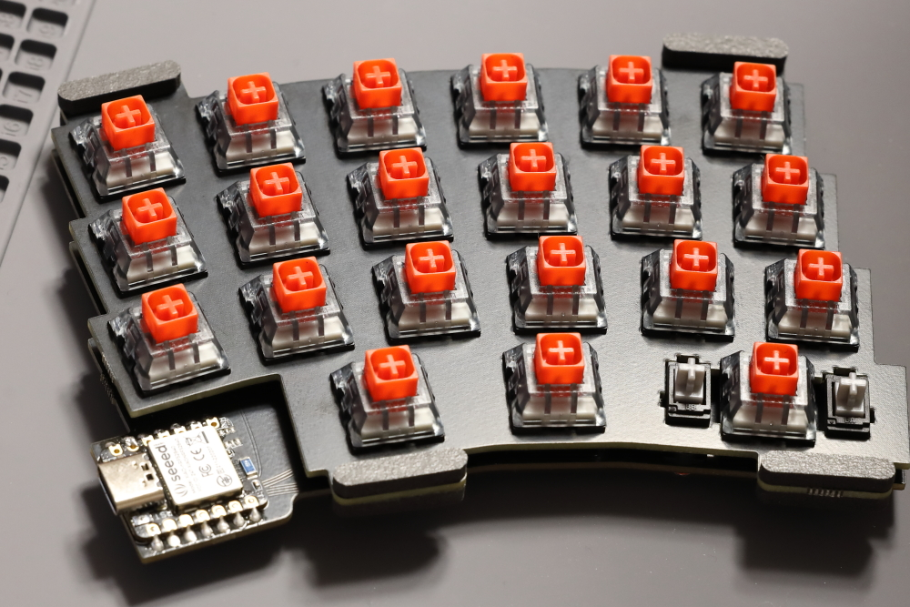
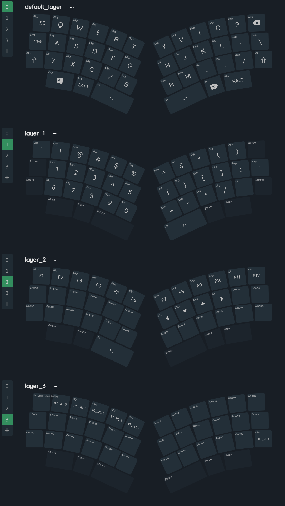

# はじめに

ArcoSplitに興味をお持ちいただきありがとうございます

本キーボードは以下の特徴を持っています

* 完全無線左右分割40%キーボード
* 円弧上のキー配置
* ZMK Firmwareを利用
* ZMK Studioに対応し、ファームウェアの書き換え無しでキーマップの変更が可能
* ガスケットマウント採用ケース付き
* 単4サイズの電池で動作

細かな設定や動作についてはぜひ[ZMK Firmwareのドキュメント](https://zmk.dev/docs)等もご参照ください

以降、本キットの組み立てについての説明を記載します

# 付属品の確認
キットには以下のものが含まれています

それぞれの部材が含まれているかご確認ください

* キーボード基板（左右1枚ずつ）
* キースイッチプレート（左右対称2枚）
* seeed studio XIAO BLE ×2
* MX キースイッチソケット ×50
* 電池基板 ×2
* 電源ケーブル ×2
* M2 皿ネジ ×8
* M2 トラスねじ ×4
* スイッチプレートガスケット ×8
* ケースゴム足 ×12
* ケース左右分
* リストレスト左右分

# 付属品以外に必要なもの
キーボードとして利用するには付属品のほかに以下のものをご用意ください

* MXタイプキースイッチ ×42
* 好みのキーキャップ
* U2サイズのスタビライザ ×2
* 単4サイズの電池 ×2

また一部はんだ付けが必要となりますのではんだ、はんだごても必要となりますのでご用意ください

# はんだ付け
## マイコンのはんだ付け
最初にマイコン（seeed XIAO BLE）の裏側、リセット用のパッドに予備はんだをします

リセットパッドに予備はんだができたら、マイコンをはんだ付けする箇所にマスキングテープ等で仮止めします

この時、裏側のスルーホールから予備はんだしたパッドが見えることを確認してください

この状態でマイコン側面のパッド、裏側のパッドをはんだ付けします

裏側のパッドのはんだ付けには細い小手先を利用することをお勧めします

## ソケットのはんだ付け

裏返してソケットのはんだ付けを行います

ソケットのはんだ付けを行う際はソケットが浮いてしまわないよう注意して実施してください

## 電池基板のはんだ付け
電池基板にはキーボード基板へ電源を供給する配線のはんだ付けを行います

配線が動く際のはんだ付け箇所へのストレス対策として、基板に穴をあけてあります

下の画像のように配線を通してはんだ付けしてください

電池基板は、キーボードの左右の区別はありませんが、配線は二つで異なる箇所に配線してください

# ファームウェアの書き込み
書き込むfirmwareは[こちらに格納されています](../dist/)

左右それぞれのファイルをダウンロードしてください

以降、以下の手順に従ってファームウェアの書き込みを実施してください
1. PCと基板上のマイコンをUSBケーブルで接続する（※注意 安価なUSB-Cのケーブルにはデータ通信ができないものがあります。この手順ではデータ通信が可能なUSB-Cのケーブルを利用してください）
1. 基板上のリセットスイッチを2度押しする
1. PCが外部ストレージとして認識したら、左右に対応するファームウェアをドラッグアンドドロップで書き込む
1. 書き込みが完了するとストレージとしてアンマウントされる

以上で書き込みは終了です。

# 組み立て
## 基板・プレートを切り離す
基板、プレートがそれぞれフレームに囲われているのを切り離す

## ガスケットの貼り付け
スイッチプレートのタブ部分にガスケットを張り付ける

## スイッチ・スタビライザの取り付け
スイッチプレートにスイッチをはめ込み、キーボード基板のソケットに差し込む

手順として、

1. スイッチプレートの四隅にスイッチを取り付ける
1. キーボード基板に差し込む（足を曲げないように！）
1. 残りのスイッチを差し込む（足を曲げないように！）

スタビライザについては、基板にスクリューマウントするタイプの場合はスイッチを差し込むよりも先に取り付けるように注意してください

## 電池基板のとりつけ
ケースに電池基板をねじ止めします（※注意 ねじが非常になめやすいので締め付ける際の力加減には十分に注意してください）

取付の際はケース内の空間の広いほうに配線が出るように取り付けてください

## 電源ケーブルの接続
キーボード基板に対して電源配線のソケットを差し込みます

向きに注意して水平方向に差し込むように注意してください

## ケースを閉じる
最後にケースの上部でスイッチプレートを挟み、裏側からねじ止めすることで組み立ては完了です

好みのキーキャップを取り付けてください

# 機器との接続
電源がオフになっていることを確認し、単四サイズの電池を左右それぞれに挿入してください

電源を入れる際は右→左の順で入れるようにしてください

それぞれの電源が入って、PCに接続したことがなければ、そのまま接続待機状態に入ります

接続したい機器のBluetooth接続の設定画面で画面より「ArcoSplit」を選び接続してください

# キーマップの変更（ZMK Studioの利用）

標準のキーマップ

ArcoSplitは[ZMK Studio](https://zmk.dev/docs/features/studio)に対応しています

Windows, Mac, Linuxのそれぞれの環境用のソフトウェアが要されておりますので[Downloadページ](https://zmk.studio/download)からダウンロードしてください

[&studio_unlock](https://zmk.dev/docs/keymaps/behaviors/studio-unlock)のキーは初期状態ではlayer3に設定されています

キーボードが接続されている状態でZMK Studioを起動しますと、アプリ側でキーボードを検出しますので以降はGUI上でキーマップを操作できます

# さらなるカスタム
さらなるZMKの設定等お試しされたい方はこちらのレポジトリをforkしてカスタムしてみてください